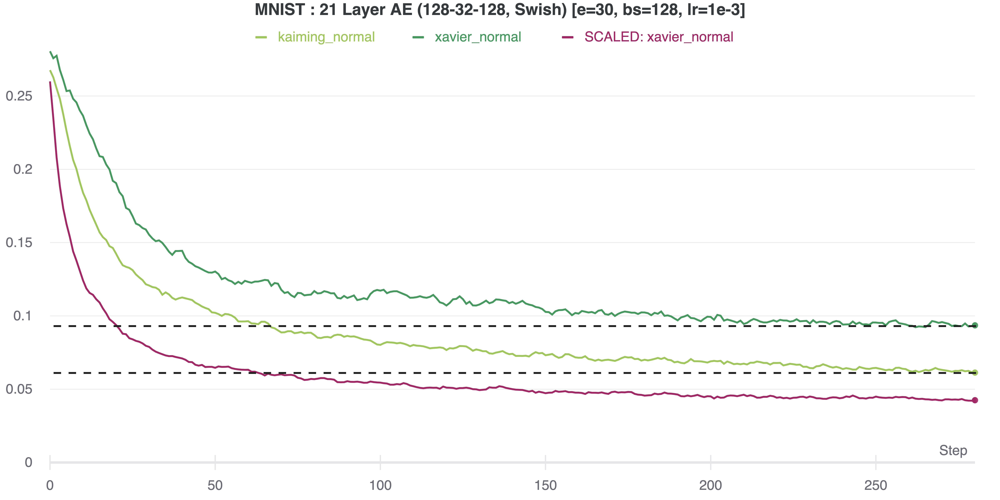

# Weight Initialisation & Normalised Activations

**NOTE**: it turns out similar ideas have already recently been investigated:
- arxiv: [2101.08692](https://arxiv.org/abs/2101.08692)
- arxiv: [2102.06171](https://arxiv.org/abs/2102.06171)

**NB** After having a look at the above, and playing around with the
initialisation methods. Their results usually beat the experiments below!

# Old Experiments

Experiments based on normalising neural network activations (or weights)
in a pretraining step, using random input noise.

The network is trained to achieve a target mean and standard deviation after each layer,
based on this normally distributed noise.

Results show that this method can improve training speed and
performance using the same number of weights.

